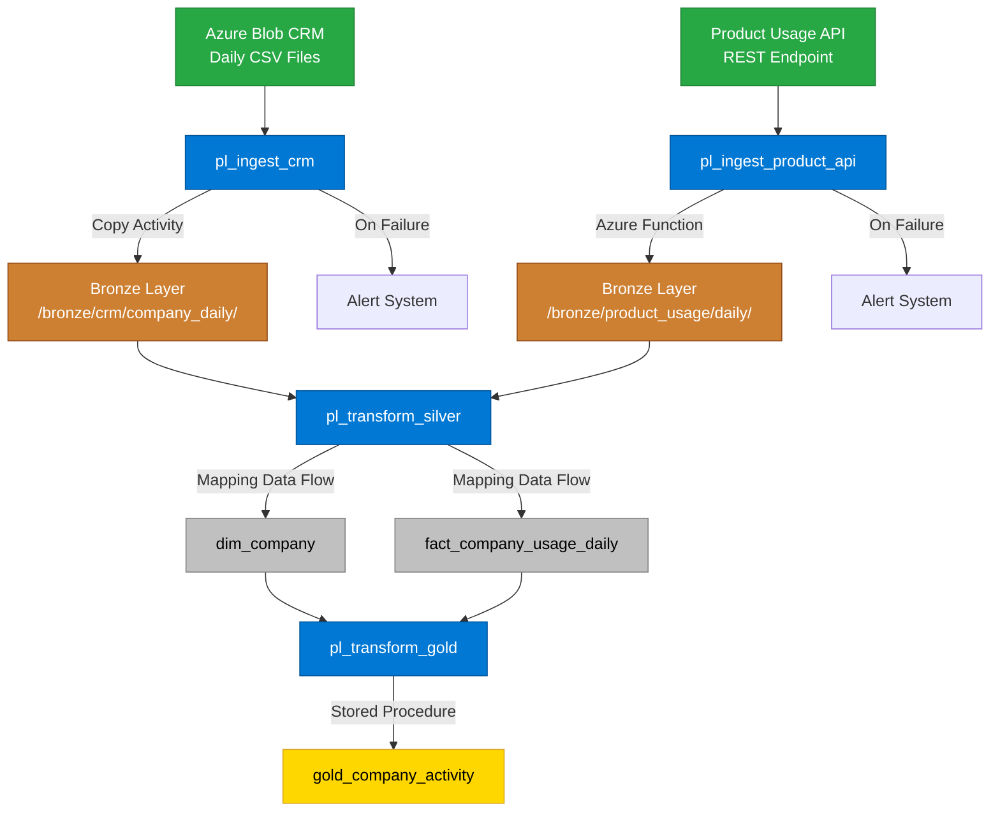

# Azure Data Factory Pipeline Architecture

> **Comprehensive guide to the Company Activity pipeline design and implementation**

## Table of Contents

- [Overview](#overview)
- [Architecture Diagram](#architecture-diagram)
- [Data Flow](#data-flow)
- [Master Pipeline Orchestration](#master-pipeline-orchestration)
- [Naming Conventions](#naming-conventions)
- [Error Handling & Monitoring](#error-handling--monitoring)

---

## Overview

This document outlines the Azure Data Factory (ADF) pipeline architecture for the Company Activity analytics platform. The solution follows a **Medallion Architecture** (Bronze → Silver → Gold) with automated ingestion, transformation, and error handling.

**Key Technologies:**
- **Azure Data Factory** - Pipeline orchestration
- **Azure Data Lake Storage Gen2** - Bronze layer storage  
- **Azure SQL Database** - Silver & Gold layers
- **Azure Functions** - API ingestion processing

---

## Architecture Diagram

### Data Ingestion & Transformation Flow



## Data Flow

### Sequential Processing Steps

| Step | Component | Input | Output | SLA |
|------|-----------|--------|---------|-----|
| 1 | **CRM Ingestion** | Blob CSV | Bronze/CRM | 15 min |
| 2 | **API Ingestion** | REST API | Bronze/Usage | 20 min |  
| 3 | **Silver Transform** | Bronze layers | Silver tables | 30 min |
| 4 | **Gold Analytics** | Silver tables | Gold table | 15 min |
| | **Total Pipeline** | - | - | **80 min** |

### Data Dependencies

```
┌─────────────────┐    ┌─────────────────┐
│   CRM Source    │    │  Usage API      │
│   (External)    │    │  (External)     │  
└─────────┬───────┘    └─────────┬───────┘
          │                      │
          ▼                      ▼
┌─────────────────┐    ┌─────────────────┐
│ Bronze/CRM      │    │ Bronze/Usage    │
│ (Raw Storage)   │    │ (Raw Storage)   │
└─────────┬───────┘    └─────────┬───────┘
          │                      │
          └──────────┬───────────┘
                     │
                     ▼
          ┌─────────────────┐
          │ Silver Layer    │
          │ (Clean & Typed) │ 
          └─────────┬───────┘
                    │
                    ▼
          ┌─────────────────┐
          │ Gold Layer      │
          │ (Analytics)     │
          └─────────────────┘
```

---

## Master Pipeline Orchestration

### Pipeline Execution Flow

The `pl_master` pipeline orchestrates the entire data processing workflow:

```yaml
Pipeline: pl_master
Trigger: Daily at 6:00 AM UTC
Timeout: 4 hours
Retry Policy: 2 attempts

Execution Steps:
  1. Execute pl_ingest_crm_company_daily
  2. Execute pl_ingest_product_usage_api  
  3. Wait for both ingestion pipelines to succeed
  4. Execute pl_transform_silver_company
  5. Execute pl_transform_gold_company_activity
```


## Naming Conventions

### Standardized Naming Schema

#### Pipelines
```
Pattern: pl_{operation}_{layer}_{entity}

Examples:
pl_ingest_crm_company_daily
pl_ingest_product_usage_api  
pl_transform_silver_company
pl_transform_gold_company_activity
```

#### Datasets  
```
Pattern: ds_{technology}_{source}_{format}

Examples:
ds_blob_crm_csv
ds_rest_product_usage
ds_adls_bronze
ds_sql_silver
ds_sql_gold
```

#### Activities
```
Pattern: act_{action}_{description}

Examples:
act_copy_crm_to_bronze
act_call_product_api
act_transform_silver
act_build_gold_table
```

### Naming Benefits

- **Consistency** - Predictable patterns across all components
- **Clarity** - Self-documenting component purposes
- **Maintainability** - Easy identification and troubleshooting
- **Scalability** - Framework supports additional pipelines

---

## Error Handling & Monitoring

### Failure Detection Strategy

| Component | Error Trigger | Alert Method | Recovery Action |
|-----------|---------------|--------------|----------------|
| **CRM Ingestion** | Copy activity failure | Email + Teams | Manual file verification |
| **API Ingestion** | HTTP 4xx/5xx errors | Email + SMS | Retry with backoff |
| **Silver Transform** | SQL execution error | Email + Teams | Data quality investigation |
| **Gold Analytics** | Stored proc failure | Email + PagerDuty | Business logic review |

### Monitoring Dashboard

**Key Metrics Tracked:**
- Pipeline success/failure rates
- Average execution times per stage
- Data volume trends (row counts, file sizes)
- Error frequency and patterns
- SLA compliance (80-minute target)

### Alert Escalation

```yaml
Level 1 - Warning (5 min delay):
  - Email to data engineering team
  
Level 2 - Critical (15 min delay):
  - Email + Teams notification  
  - SMS to on-call engineer
  
Level 3 - Outage (30 min delay):
  - PagerDuty incident creation
  - Manager notification
  - Business stakeholder alert
```

